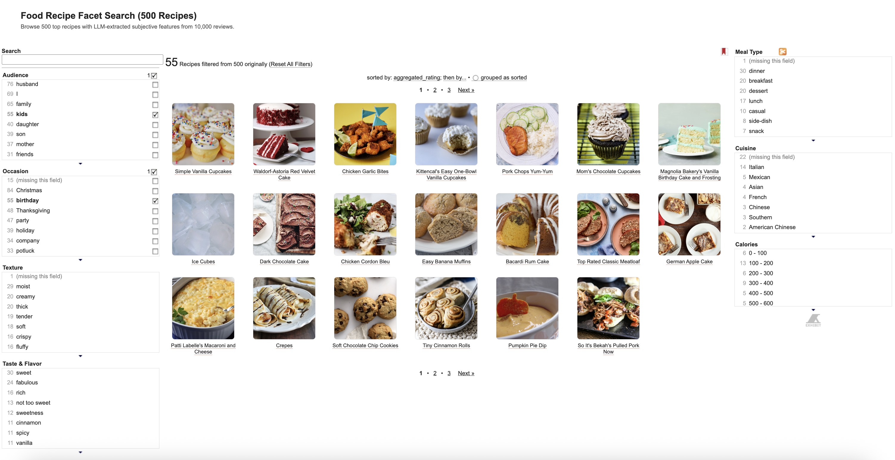
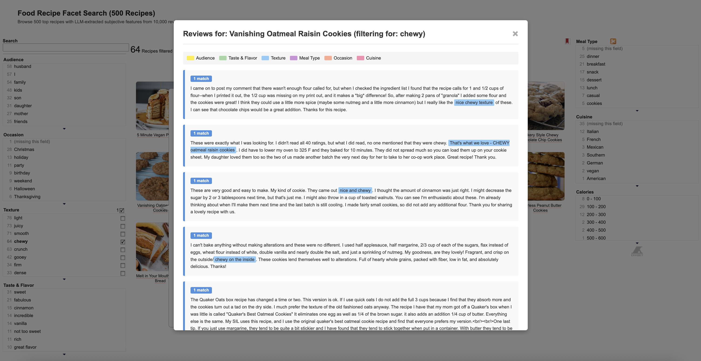
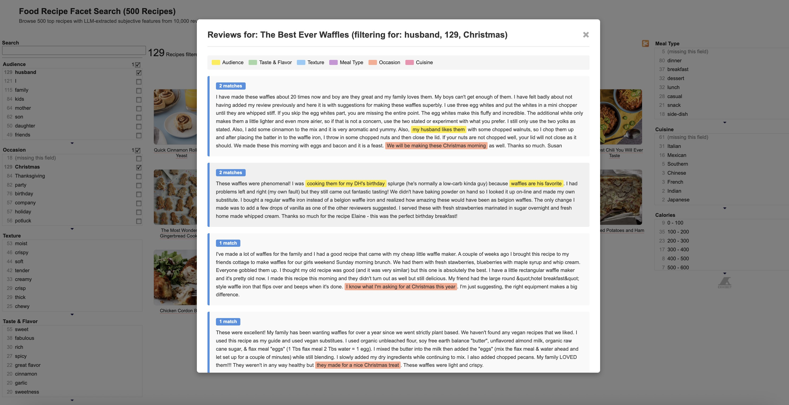

# SER-DB: Subjective Experience Repository

A demonstration of extracting and organizing subjective product needs (SPN) from food reviews using LLM-based attribute extraction.

## Preview the Demo

### Option 1: Using Live Server (VS Code Extension)

1. Install the [Live Server extension](https://marketplace.visualstudio.com/items?itemName=ritwickdey.LiveServer) in VS Code
2. Right-click on `food-exhibit-500recipes.html`
3. Select "Open with Live Server"
4. The page will open automatically in your browser

### Option 2: Using Python HTTP Server

1. Start a local HTTP server in this directory:
   ```bash
   python3 -m http.server 8080
   ```

2. Open your browser and navigate to:
   ```
   http://localhost:8080/food-exhibit-500recipes.html
   ```

3. When done, stop the server with `Ctrl+C`

## Demo Screenshots

### Faceted Search Interface
The main interface allows browsing and filtering recipes across multiple subjective dimensions:



### Review Highlights
Click any recipe to view reviews with color-coded highlighting showing where each attribute was extracted:



### Filtered Reviews - Thanksgiving Example
Filter by specific attributes like "husband" and "Thanksgiving" to see only matching reviews with highlighted spans:


### Filtered Reviews - Christmas Example
Another example showing how filtering works for holiday-specific attributes like "Christmas":



## Data Source

**Original Dataset**: [Food.com - Recipes and Reviews (Kaggle)](https://www.kaggle.com/datasets/irkaal/foodcom-recipes-and-reviews)

- **Full Dataset**: 522,517 recipes with 1,401,982 reviews from 271,907 users
- **Demo Subset**: 500 top-rated recipes with ~10,000 reviews (20 reviews per recipe)
- **License**: [CC0: Public Domain](https://creativecommons.org/publicdomain/zero/1.0/)
- **Academic Use**: ✅ **Freely available for academic research, education, and commercial purposes with no restrictions**

The demo showcases how subjective experiences can be systematically extracted from natural language reviews and organized into a browsable, faceted interface.

## Category Settings

The extraction uses **6 independent dimensions** (a single review phrase can belong to multiple categories):

| Dimension | Description | Examples |
|-----------|-------------|----------|
| **Taste-Flavor** | Taste and flavor profile | delicious, bland, salty, sweet, savory, rich, balanced |
| **Texture-Mouthfeel** | Physical feel in mouth | tender, crispy, moist, dry, creamy, fluffy, chewy |
| **Difficulty-Effort** | Ease of preparation | easy, quick, complicated, time-consuming, beginner-friendly |
| **Occasion-Holiday** | When/what event to serve | Christmas, Thanksgiving, birthday, potluck, weeknight |
| **Audience-Enjoyment** | Who enjoys eating (not cooking) | kids, husband, grandmother, guests, whole family |
| **Cuisine-Type** | Cuisine style/origin | Italian, Chinese, Southern, Mexican, fusion, homestyle |

### Key Features:
- **Multi-category assignment**: A phrase like "tender, delicious chicken" extracts to both Texture (tender) and Taste (delicious)
- **Normalization allowed**: "My hubby loved it" → "husband loved it"
- **Sentiment tracking**: Each attribute is tagged as positive, negative, or neutral

## Extraction Prompt

The LLM extraction uses this prompt structure:

```
Extract attributes from this food/recipe review across 6 independent dimensions.

## 6 Independent Dimensions (a phrase can belong to MULTIPLE categories):

1. Taste-Flavor: The TASTE and FLAVOR profile
   Examples: delicious, bland, too salty, perfectly seasoned, rich, tangy

2. Texture-Mouthfeel: The PHYSICAL FEEL in the mouth
   Examples: tender, crispy, moist, dry, creamy, fluffy

3. Difficulty-Effort: How EASY or HARD to prepare
   Examples: easy, simple, quick, complicated, time-consuming

4. Occasion-Holiday: WHEN or for what EVENT to serve
   Examples: Christmas, Thanksgiving, birthday, potluck, weeknight

5. Audience-Enjoyment: WHO enjoys EATING this (not who cooked it)
   Examples: kids loved it, husband's favorite, guests raved

6. Cuisine-Type: The CUISINE STYLE or cultural/regional origin
   Examples: Italian, Mexican, Southern, fusion, authentic

## Rules:
- A single phrase CAN belong to multiple categories
- Normalize attributes while preserving meaning
- Skip ingredient lists and measurements

## Output Format:
[{"category": "...", "attribute": "...", "span": "...", "sentiment": "..."}]
```

**API Configuration:**
- Endpoint: `https://ellm.nrp-nautilus.io/v1/chat/completions`
- Model: `gemma3`
- Temperature: 0.2

## Demo Features

- **Faceted browsing**: Filter recipes by any combination of extracted attributes
- **Review highlights**: Click recipes to see reviews with highlighted extraction spans
- **Context-aware**: Selected facets filter both recipes and visible attributes
